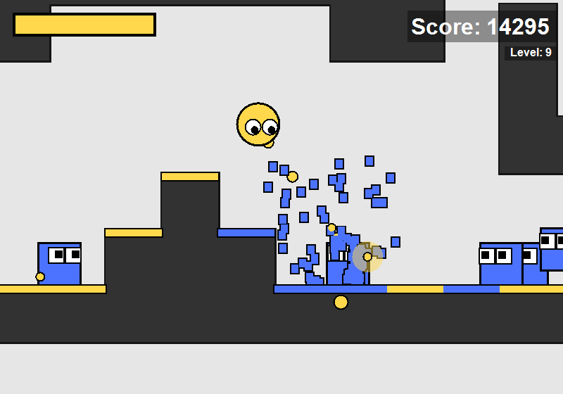

# Paint Wars

Kill enemies and descend downwards to increase your level, score multiplier and difficulty. Enemies drop health pick-ups when killed.

One of my first programming projects made for a school assignment in October 2015. The code is terrible and is likely of no use to anyone. Published for archival reasons.

	

## Features

- Entity physics (collision detection + gravity)
- Particle physics
- Enemy AI
- Chunk based, randomized, repeating world
- Chunk editor

## Running the game

Download and run [28.exe](<https://github.com/swift502/PaintWars/raw/main/build_archive/28.exe>) from the build archive.

To build the project, open the project solution in Visual Studio and Start the project.

## Controls

| Input | Action |
| --- | --- |
|`WASD` | Movement |
| `LMB` | Shoot paint |
| `E` | Toggle enemy spawning |
| `G` | God mode |
| `S` | Spawn enemy |
| `Mouse wheel` | Change time scale |
